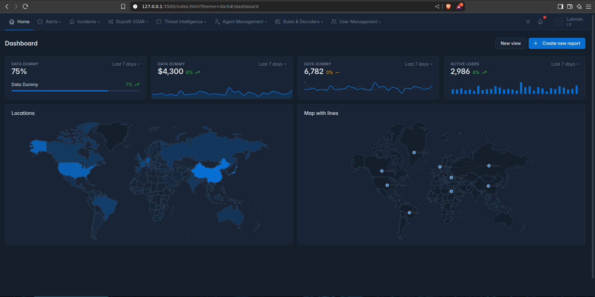

# SIEM(Security Information and Event Management) Monitor Tool

**SIEM Monitor Tool** adalah proyek internal yang dirancang untuk memantau, mengumpulkan, dan menganalisis data keamanan dari berbagai sumber dalam satu sistem terpadu. Sistem ini membantu tim keamanan untuk mendeteksi ancaman, menganalisis insiden, dan merespons potensi pelanggaran dengan cepat dan efisien.

## 🚧 Status
**Private / Closed-source Project**  
Repositori ini digunakan secara internal oleh tim pengembang dan tidak tersedia untuk umum.

## 🎯 Tujuan Proyek
- Membangun sistem pemantauan keamanan real-time.
- Mengumpulkan log dari berbagai sumber (endpoint, server, firewall, dll).
- Menyediakan dashboard analitik dan alert.
- Mempermudah investigasi insiden keamanan.

## 🔒 Catatan Privasi
Kode sumber proyek ini tidak dibuka untuk umum dan hanya ditujukan untuk penggunaan internal tim pengembang.  

## 📁 Struktur Proyek
> Struktur akan bervariasi tergantung pada teknologi dan modul yang digunakan.

